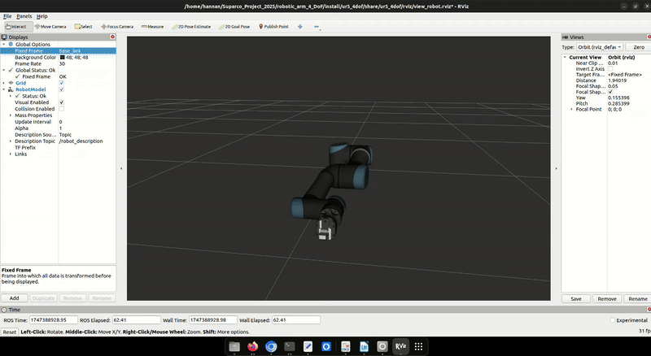

🚀 Custom 4-DoF Robotic Arm (UR5 Conversion) with Robotiq-Style Gripper
ROS 2 Humble | Gazebo Classic | RViz | URDF/XACRO | ros2_control

This project showcases a fully customized 4-DoF robotic manipulator, created by modifying the original Universal Robots UR5.
I redesigned the UR5 arm by reducing degrees of freedom from 6 → 4, rebuilt the kinematic chain, integrated a Robotiq Hand-E style gripper, and created a complete simulation stack for ROS 2.

This repo demonstrates strong skills in robot modeling, transforms, meshes, sensors, simulation, and ROS2 integration, making it ideal for robotics research and industrial applications.

🎯 Project Features
🔧 URDF/XACRO

Completely rebuilt URDF for a 4-DoF arm

Accurate joint limits, inertial elements, and transforms

Modular XACRO files for easy extension

High-quality visual & collision meshes

🦾 Gripper Integration

Robotiq Hand-E inspired parallel gripper

Dual prismatic finger joints with proper mimic + limit tags

XACRO macros for easy reuse

🎮 Simulation + Visualization

RViz2 for robot visualization

Gazebo Classic simulation

Add-on camera sensor (STL + DAE meshes)

Example world files + launch scripts

🤖 ros2_control Support

Mock hardware interface for simulation

ros2_control YAML configuration

Joint trajectory controller support

Launch files to view, spawn, and simulate the arm

📂 Repository Structure
src/
 ├── ur5_4dof/                 --> Main robot package
 │    ├── urdf/                --> URDF + XACRO files
 │    ├── meshes/              --> Visual + collision meshes
 │    ├── launch/              --> RViz & Gazebo launch files
 │    ├── worlds/              --> Simulation environments
 │    └── package.xml
 │
 ├── robotiq_hande_description/ --> Gripper description package
 │    ├── urdf/
 │    ├── meshes/
 │    └── launch/
 │
 └── ur_description/            --> Adapted UR5 resources
      ├── config/
      ├── meshes/
      └── urdf/

▶️ How to Build & Run
1. Clone the repo
git clone https://github.com/hannan-jamil/ur5_4dof_custom_robotic_arm.git
cd ur5_4dof_custom_robotic_arm

2. Build workspace
colcon build
source install/setup.bash

3. View robot in RViz
ros2 launch ur5_4dof display_4dof_with_gripper.launch.py

4. Spawn in Gazebo
ros2 launch ur5_4dof spawn_arm.launch.py

## 🎥 Demo (GIF)

## 🧠 My Contribution
- Converted the 6-DoF UR5 into a custom 4-DoF robot
- Redesigned joint structure & updated URDF/XACRO
- Integrated a Robotiq HandE-style gripper (from CAD → meshes → URDF)
- Fixed inertias, collision geometries, and link origins
- Added Gazebo simulation with a camera sensor
- Implemented ros2_control for joint trajectory control
- Created complete launch system for RViz, Gazebo, and URDF viewing

❤️ Credits / Inspiration

Universal Robots ROS2 packages

Robotiq HandE gripper (open-source models)

📬 Contact

Hannan Jamil – Robotics & Electronics Engineer
LinkedIn: https://www.linkedin.com/in/hannanjamil

